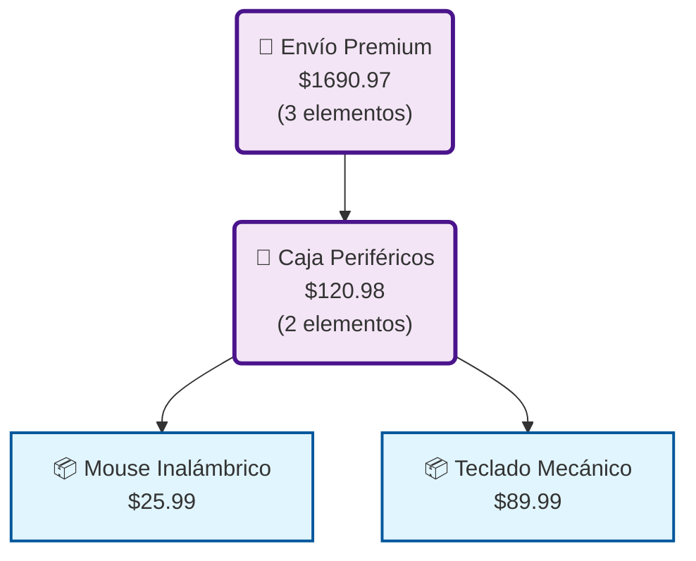

# 📊 Diagramas Mermaid - Visualización del Patrón Composite

## 🎯 ¿Qué se ha generado?

El sistema ha creado automáticamente **diagramas Mermaid** que representan gráficamente la estructura del árbol de productos, mostrando visualmente cómo funciona el patrón Composite.

## 📁 Archivos Generados

### 📄 Archivos .mmd (Código Mermaid)
- `elemento-1-envío-premium.mmd` - Diagrama de la estructura completa
- Contiene el código fuente del diagrama en sintaxis Mermaid

### 🌐 Archivos .html (Visualización Completa)
- `elemento-1-envío-premium.html` - Página web con el diagrama renderizado
- Incluye estilos, leyenda y explicaciones del patrón

## 🔍 Formas de Visualizar los Diagramas

### 1. 🌐 **Archivo HTML (Recomendado)**
```bash
# Abrir el archivo HTML en tu navegador favorito
start elemento-1-envío-premium.html        # Windows
open elemento-1-envío-premium.html         # macOS
xdg-open elemento-1-envío-premium.html     # Linux
```

### 2. 📋 **Mermaid Live Editor**
1. Ir a [mermaid.live](https://mermaid.live)
2. Copiar el contenido del archivo `.mmd`
3. Pegarlo en el editor
4. Ver el diagrama renderizado en tiempo real

### 3. 🔧 **VS Code con Extensión**
1. Instalar la extensión "Mermaid Preview" en VS Code
2. Abrir el archivo `.mmd`
3. Usar `Ctrl+Shift+P` → "Mermaid Preview: Open Preview"

### 4. 📝 **GitHub/GitLab**
- Los archivos `.mmd` se renderizan automáticamente en README files
- Simplemente incluir el código en un bloque de código markdown:

```markdown
```mermaid
graph TD
    %% Tu código mermaid aquí
```

## 🎨 Estructura del Diagrama Generado

### 📊 **Representación Visual**

```
📁 Envío Premium ($1690.97)
├── 📁 Caja Periféricos ($120.98)
│   ├── 📦 Mouse Inalámbrico ($25.99)
│   └── 📦 Teclado Mecánico ($89.99)
├── 📁 Caja Electrónicos ($1514.99)
│   ├── 📦 Laptop Gaming ($1200.00)
│   └── 📦 Monitor 24" ($299.99)
└── 📦 Libro TypeScript ($45.00)
```

### 🎯 **Elementos del Diagrama**

| Símbolo | Tipo | Descripción |
|---------|------|-------------|
| 📁 | Caja (Composite) | Puede contener otros elementos |
| 📦 | Producto (Leaf) | Elemento terminal |
| → | Relación | "Contiene" o "Es parte de" |

### 🎨 **Código de Colores**

- **🔵 Azul**: Productos (Leafs) - elementos terminales
- **🟣 Morado**: Cajas (Composites) - contenedores
- **Precios**: Se calculan recursivamente por el patrón

## ✨ Beneficios de la Visualización

### 🎯 **Para Estudiantes**
- **Visual**: Entiende el patrón de un vistazo
- **Interactivo**: Puede modificar y ver cambios
- **Educativo**: Conecta teoría con práctica

### 🔧 **Para Desarrolladores**
- **Debugging**: Identifica problemas en la estructura
- **Documentación**: Comunica arquitectura fácilmente
- **Análisis**: Visualiza complejidad y relaciones

### 📊 **Para Presentaciones**
- **Profesional**: Diagramas listos para presentar
- **Explicativo**: Muestra flujo de cálculos
- **Escalable**: Se adapta a estructuras complejas

## 🛠️ Personalización Avanzada

### 🎨 **Modificar Estilos**

En el archivo `.mmd`, puedes cambiar los estilos:

```mermaid
%% Estilos personalizados
classDef producto fill:#ffeb3b,stroke:#f57f17,stroke-width:3px
classDef caja fill:#e8f5e8,stroke:#2e7d32,stroke-width:4px
```

### 📝 **Agregar Información**

Modificar los nodos para incluir más datos:

```mermaid
nodo1["📦 Producto<br/>$99.99<br/>Stock: 15<br/>Categoría: Tech"]
```

### 🔄 **Diferentes Layouts**

Cambiar la orientación del diagrama:

```mermaid
graph LR  %% Left to Right
graph BT  %% Bottom to Top
graph RL  %% Right to Left
```

## 📋 Ejemplo de Uso del Código Mermaid



## 🔧 Troubleshooting

### ❌ **El diagrama no se ve**
- Verificar que Mermaid.js esté cargado
- Revisar la sintaxis del código
- Comprobar que el navegador soporte JavaScript

### 🐛 **Errores de sintaxis**
- Validar el código en [mermaid.live](https://mermaid.live)
- Verificar que los IDs de nodos sean únicos
- Comprobar que las conexiones usen IDs válidos

### 📱 **Problemas de renderizado**
- Actualizar la página
- Probar en otro navegador
- Verificar la conexión a internet (para cargar Mermaid.js)

## 🎓 Ejercicios Propuestos

1. **Modificar la estructura**: Agregar más productos y ver cómo cambia el diagrama
2. **Crear variaciones**: Generar diagramas para diferentes configuraciones
3. **Experimentar con estilos**: Cambiar colores y formas
4. **Documentar**: Usar los diagramas en documentación de proyectos

## 🌟 Casos de Uso Avanzados

- **Análisis de costos**: Visualizar dónde se concentran los gastos
- **Optimización**: Identificar oportunidades de mejora en empaquetado
- **Validación**: Confirmar que la estructura sea correcta
- **Comunicación**: Explicar arquitectura a stakeholders

---

🎉 **¡Ahora tienes una herramienta poderosa para visualizar el patrón Composite!**

Los diagramas Mermaid te permiten ver de forma gráfica cómo los elementos se organizan jerárquicamente y cómo el patrón Composite maneja la uniformidad entre objetos simples y complejos.