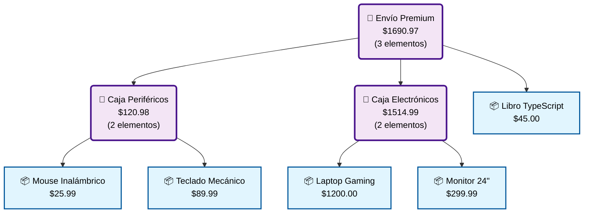

# 🛒 Sistema de Pedidos - Patrón Composite

## 🎯 Problema Resuelto

**Problema Original:**
> Tenemos dos tipos de objetos: **Productos** y **Cajas**. Una Caja puede contener varios Productos así como cierto número de Cajas más pequeñas. Las Cajas pequeñas también pueden contener algunos Productos o incluso Cajas más pequeñas, y así sucesivamente.
> 
> ¿Cómo determinamos el precio total de un pedido que puede contener productos sencillos sin envolver, así como cajas llenas de productos... y otras cajas?

## 💡 Solución con Patrón Composite

El patrón Composite resuelve este problema perfectamente porque:

1. **Uniformidad**: Tanto productos como cajas implementan la misma interfaz
2. **Recursión**: El cálculo de precios se propaga automáticamente por toda la estructura
3. **Transparencia**: El código cliente no necesita distinguir entre productos y cajas

## 🏗️ Arquitectura de la Solución

```
ElementoPedido (Component)
├── calcularPrecio(): number
├── obtenerDescripcion(nivel): string
│
├── Producto (Leaf)
│   └── calcularPrecio() → precio base
│
└── Caja (Composite)
    ├── contenido: ElementoPedido[]
    └── calcularPrecio() → costo caja + suma(contenido.calcularPrecio())
```

## 📦 Componentes del Sistema

### 🔹 ElementoPedido (Component)
- Clase abstracta base que define la interfaz común
- Operaciones principales: `calcularPrecio()` y `obtenerDescripcion()`

### 🔹 Producto (Leaf)
- Representa elementos terminales (no pueden contener otros elementos)
- Tiene precio fijo y categoría
- Su `calcularPrecio()` simplemente retorna su precio base

### 🔹 Caja (Composite)
- Puede contener productos y otras cajas
- Tiene costo base propio + costo del contenido
- Su `calcularPrecio()` suma su costo + precio de todo el contenido recursivamente

### 🔹 GestorPedidos (Cliente)
- Maneja la colección de elementos del pedido
- Genera reportes y estadísticas
- Demuestra la transparencia del patrón

## � Visualización Gráfica del Árbol

¡Ahora puedes generar diagramas Mermaid automáticamente! El sistema incluye funcionalidad para crear representaciones visuales del patrón Composite.

### 🎨 Diagrama del Ejemplo



### 🚀 Generar Tus Propios Diagramas

```bash
# Ejecutar el sistema con generación de diagramas
node dist/sistema-con-diagramas.js

# Archivos generados:
# • *.mmd (código Mermaid)
# • *.html (visualización completa)
```

📋 **Ver guía completa**: `GUIA-DIAGRAMAS.md`

## �🚀 Ejecución del Ejemplo

### Compilar y Ejecutar:

```bash
# Navegar al directorio
cd composite

# Compilar TypeScript
npx tsc

# Ejecutar el sistema de pedidos
node dist/sistema-pedidos.js
```

### Alternativa con ts-node:

```bash
npx ts-node sistema-pedidos.ts
```

## 📊 Ejemplo de Ejecución

El programa crea un escenario realista:

1. **Productos individuales**: Laptop, mouse, teclado, monitor, etc.
2. **Estructura de cajas anidadas**:
   ```
   📦 Caja Envío Completo ($10)
   ├── 📦 Caja Periféricos ($5)
   │   ├── 🖱️ Mouse ($25.99)
   │   ├── ⌨️ Teclado ($89.99)
   │   └── 🔌 Cable ($19.99)
   ├── 📦 Caja Electrónicos ($15)
   │   ├── 💻 Laptop ($1200)
   │   └── 🖥️ Monitor ($299.99)
   └── 📚 Libro ($45)
   ```

3. **Cálculo automático**: 
   - Precio total = $1,710.96 (calculado recursivamente)

## ✨ Beneficios Demostrados

### 🎯 **Uniformidad**
```typescript
// El mismo método funciona para productos y cajas
elemento.calcularPrecio(); // Funciona igual para ambos
```

### 🔄 **Recursión Automática**
```typescript
// La caja calcula automáticamente el precio de todo su contenido
public calcularPrecio(): number {
    let precioTotal = this.costoCaja;
    for (const elemento of this.contenido) {
        precioTotal += elemento.calcularPrecio(); // ¡Recursión!
    }
    return precioTotal;
}
```

### 🧩 **Flexibilidad**
- Fácil agregar nuevos tipos (ej: `ProductoDigital`, `CajaEspecial`)
- Estructura dinámica del pedido
- Anidamiento ilimitado

### 💡 **Simplicidad del Cliente**
```typescript
// El gestor no distingue entre productos y cajas
for (const elemento of this.elementos) {
    total += elemento.calcularPrecio(); // Transparente
}
```

## 🌍 Casos de Uso Similares

1. **💰 Facturas**: Elementos individuales y grupos de elementos
2. **🏢 Organizaciones**: Empleados y departamentos con subdepartamentos
3. **📄 Documentos**: Secciones, subsecciones, párrafos
4. **🍽️ Menús**: Platos individuales y menús combinados
5. **🎨 Interfaces**: Widgets simples y contenedores complejos

## 📈 Ventajas del Patrón

| Ventaja | Descripción |
|---------|-------------|
| **Transparencia** | Cliente trata hojas y composites igual |
| **Recursión Natural** | Operaciones se propagan automáticamente |
| **Extensibilidad** | Fácil agregar nuevos tipos de componentes |
| **Mantenibilidad** | Código limpio y bien estructurado |
| **Reutilización** | Componentes se pueden usar en diferentes contextos |

## ⚠️ Consideraciones

- **Complejidad**: Puede ser excesivo para estructuras simples
- **Rendimiento**: Muchas llamadas recursivas en estructuras muy profundas
- **Tipos**: Control de tipos más flexible pero menos estricto

## 🔧 Posibles Extensiones

1. **Descuentos**: Implementar descuentos por volumen en cajas
2. **Impuestos**: Diferentes tipos de impuestos según categoría
3. **Peso**: Calcular peso total para costos de envío
4. **Validaciones**: Restricciones de contenido por tipo de caja
5. **Optimización**: Cache de cálculos para estructuras complejas

## 📚 Conceptos Clave Aprendidos

1. **Composición sobre Herencia**: Estructura flexible mediante composición
2. **Polimorfismo**: Una interfaz, múltiples implementaciones
3. **Recursión**: Procesamiento natural de estructuras anidadas
4. **Transparencia**: Uniformidad en el tratamiento de objetos
5. **Escalabilidad**: Fácil extensión sin modificar código existente

---

🎓 **Para Estudiantes**: Este ejemplo demuestra cómo el patrón Composite resuelve elegantemente problemas complejos de estructuras jerárquicas en el mundo real.